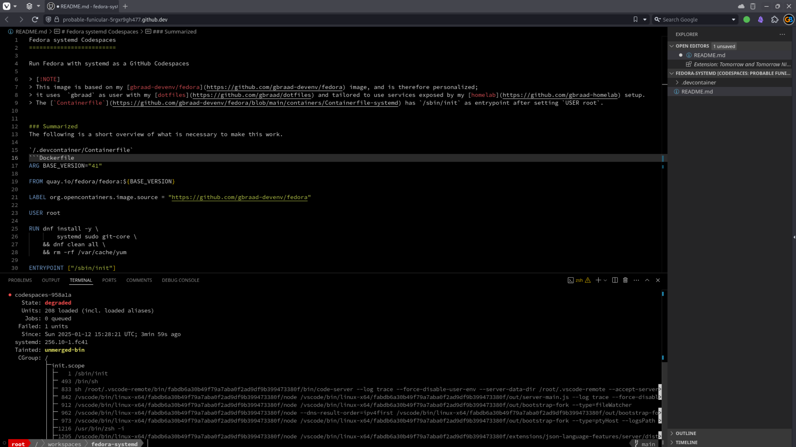

Fedora systemd Codespaces
=========================

Run Fedora with systemd as a GitHub Codespaces

> [!NOTE]
> This image is based on my [gbraad-devenv/fedora](https://github.com/gbraad-devenv/fedora) image, and is therefore personalized;
> it uses  `gbraad` as user with my [dotfiles](https://github.com/gbraad/dotfiles) and tailored to use services exposed by my [homelab](https://github.com/gbraad-homelab) setup.
> The [`Containerfile`](https://github.com/gbraad-devenv/fedora/blob/main/containers/Containerfile-systemd) has `/sbin/init` as entrypoint after setting `USER root`.


### Try it out

[](https://codespaces.new/gbraad-devenv/fedora-systemd)


### Summarized
The following is a short overview of what is necessary to make this work.

`/.devcontainer/Containerfile`
```Dockerfile
ARG BASE_VERSION="41"

FROM quay.io/fedora/fedora:${BASE_VERSION}

LABEL org.opencontainers.image.source = "https://github.com/gbraad-devenv/fedora"

USER root

RUN dnf install -y \
        systemd sudo git-core \
    && dnf clean all \
    && rm -rf /var/cache/yum

ENTRYPOINT ["/sbin/init"]
```

`/.devcontainer/devcontainer.json`
```json
{
    "name": "Fedora with systemd on Codespaces",
    "build": {
        "dockerfile": "Containerfile"
    },
    "overrideCommand": false,
    "privileged": true
}
```

### Screenshot


